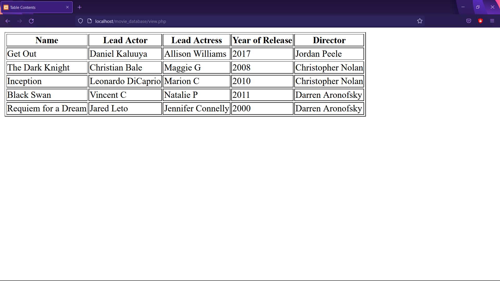
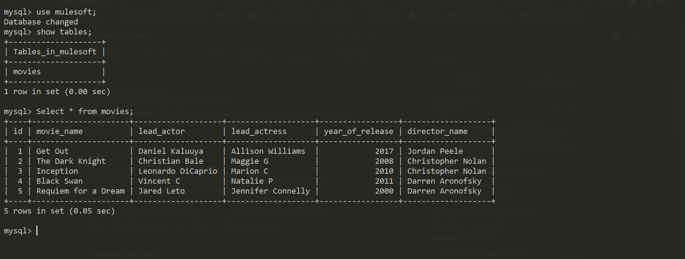

# Movie Database - MuleSoft Assignment

### Movie Database Management using `PHP` and `MySQL`

### Database Connection is accomplished using `PDO` in `PHP`

### Requirements:

* **XAMPP** or **Laragon** to set up `MySQL`, `PHP`, and `Apache Server`
* Web Browser for Output.

# Output

